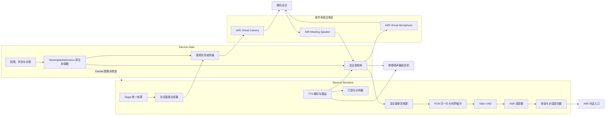
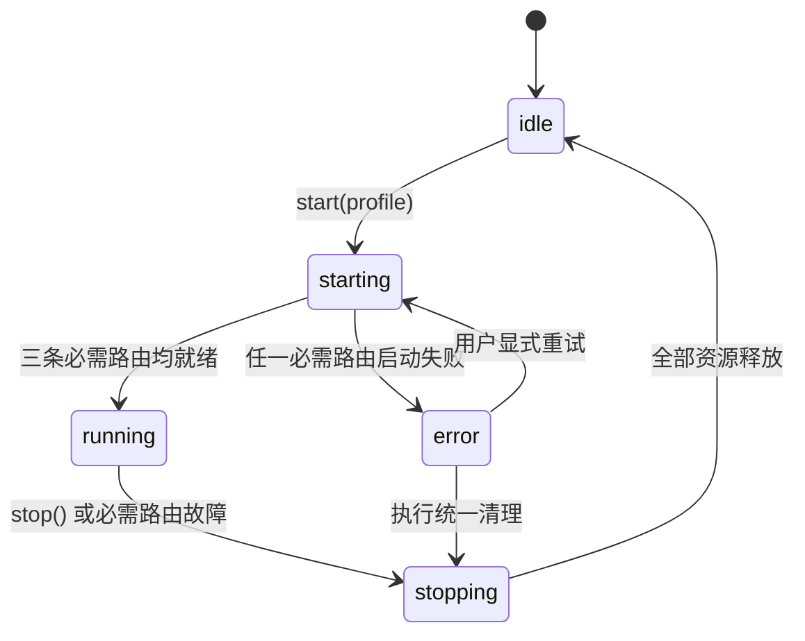
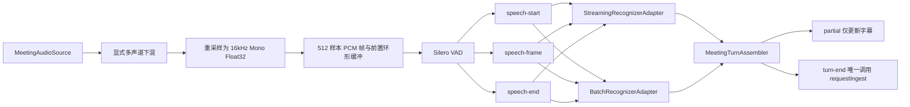

# AIRI 虚拟摄像头与会议媒体桥需求与实现方案

## 文档信息

- 状态：实现中
- 创建日期：2026-07-30
- 最后更新：2026-07-31
- 适用工程：`apps/stage-tamagotchi`、`packages/stage-ui`、`packages/stage-shared`
- 首要验收客户端：腾讯会议桌面端
- 最终目标平台：macOS、Windows、Linux
- 首个实现平台：macOS
- 需求范围：虚拟摄像头、会议回传音频接入、VAD/ASR 流水线、AIRI 语音回送、会话控制与诊断
- 代码作者标识：hutianyu

## 背景

目标是在 AIRI 桌面端内建立完整的会议媒体桥，使腾讯会议把 AIRI 视为标准摄像头和麦克风，同时让 AIRI 能接收腾讯会议的远端混合音频，经过 VAD、ASR 和对话入口驱动角色响应。

本需求不是单独增加一个“导出画面”按钮，也不是仅依赖 OBS、BlackHole、VB-CABLE 等外部软件完成拼接。最终交付需要由 AIRI 管理统一会话、媒体路由、原生设备生命周期、权限、错误和诊断；外部软件只允许用于开发期对照验证。

### 当前实现事实

| 能力 | 当前实现 | 与目标的差距 |
| --- | --- | --- |
| 角色画面 | `packages/stage-ui/src/components/scenes/Stage.vue` 已为 Live2D、VRM、Spine、Tachie、MMD 提供统一画布访问和静态 `captureFrame()` | 只能生成静态 PNG；没有固定规格的会议合成画布、实时帧输送、背压或操作系统虚拟摄像头 |
| Godot 画面 | Godot Stage 通过独立原生窗口/视图承载 | 尚未接入统一帧源，不能直接进入现有 `captureFrame()` |
| 音频设备输入 | `audio-device.ts` 可枚举并按 `deviceId` 打开任意 `MediaStream` 输入 | 只有单一“麦克风”语义；默认始终开启 AGC、AEC、降噪，不适合接收会议回传音频；没有设备热插拔失败契约 |
| VAD | 已有 Silero VAD Worker、AudioWorklet、阈值和静音时长配置 | 模型运行时从 Hugging Face 拉取；Worklet 只取第一个声道；会议模式仍可能走音量阈值分段 |
| ASR | `hearing.ts` 同时支持流式识别和录音后批量识别 | 流式路径与 VAD/录音路径分叉；流式句末可直接进入对话，批量路径经转录缓冲，缺少统一的分段、去重和过期结果隔离 |
| 对话接入 | 桌面首页已将识别结果接到 `requestIngest` | 不同 ASR 路径提交语义不一致，无法保证一个会议发言只提交一次 |
| AIRI 发声 | `Stage.vue` 将 TTS `AudioBufferSourceNode` 连接本地 `audioContext.destination`，并同时驱动分析器和口型 | 只能从本机扬声器播放；没有可被腾讯会议选中的虚拟麦克风，也没有本地监听与会议输出的独立路由 |
| 双工策略 | AIRI 发声期间会停止 hearing，并在结束后延迟恢复 | 这是面向物理麦克风防自听的半双工策略；在会议收音和 AIRI 输出已物理隔离时会不必要地漏听远端讲话 |
| Electron 原生侧 | 已使用 Eventa、injeca、hardened runtime、notarization 和媒体权限服务 | 没有 Camera Extension、Media Foundation 虚拟摄像头、虚拟音频设备或跨进程实时帧缓冲；macOS entitlement 也未覆盖系统扩展及共享容器 |

### 结论

现有工程能够复用角色渲染、设备选择、VAD、ASR、TTS 播放和对话入口，但不能直接满足腾讯会议接入。缺失的是一层统一的“会议媒体会话”，以及每个平台真正向操作系统注册的虚拟视频、虚拟音频设备。

## 要做什么

1. 在操作系统中注册 `AIRI Virtual Camera`，使腾讯会议可以像选择普通摄像头一样选择 AIRI。
2. 输出固定规格、无 AIRI 设置界面和悬浮控件的角色画面，支持 1280×720@30fps 和 1920×1080@30fps。
3. 建立独立的会议接收音频总线，让腾讯会议的扬声器输出进入 AIRI，并可选择是否同时监听到物理扬声器或耳机。
4. 把会议接收音频统一处理为 16kHz、单声道、Float32 PCM，再依次进入 VAD、ASR 和对话入口。
5. 同时支持流式 ASR 与批量 ASR，但二者使用同一套 VAD 分段、事件标识、转录组装和提交语义。
6. 在操作系统中注册 `AIRI Virtual Microphone`，把 AIRI 的 TTS 输出送入腾讯会议，同时保留可选本地监听、口型和音频分析。
7. 用一个 `MeetingMediaSession` 管理三条媒体路由的启动、停止、故障清理、权限、设备状态和诊断。
8. 在 AIRI 设置页提供会前检查、媒体配置、开始/停止和运行状态，不要求用户手工拼接多个隐含步骤。
9. 完成 macOS、Windows、Linux 平台适配；按 macOS 垂直链路先落地，再扩展 Windows 和 Linux。

## 不做什么

- 不接入腾讯会议私有 SDK、私有协议或进程注入；只使用操作系统标准音视频设备契约。
- 不把整个 AIRI 窗口、桌面或屏幕录制作为最终摄像头输出，因为其中包含 UI，且尺寸、透明度和窗口遮挡不可控。
- 不把 OBS Virtual Camera、BlackHole、VB-CABLE、VoiceMeeter 等第三方应用设为正式运行依赖。
- 不把浏览器版和移动端纳入本次交付；本需求只落在 Electron 桌面端。
- 不从腾讯会议的混合音频中推断参会人身份；若 ASR 服务明确返回说话人标识，只保留服务端提供的元数据。
- 不在会议模式中静默切回默认麦克风、音量阈值分段或其他 ASR Provider。
- 不自动安装 Linux 内核模块，不绕过 macOS 系统扩展授权，也不绕过 Windows 驱动签名要求。
- 不默认落盘原始视频帧、原始会议音频或完整转录文本。
- 未单独授权时不为本需求新增测试文件；验证使用现有类型检查、Lint、构建和真实设备验收链路。

## 用户流程

### 首次安装和授权

1. 用户安装 AIRI 桌面端。
2. AIRI 检测当前平台的视频设备扩展和音频设备是否已安装、签名是否有效、是否已获系统批准。
3. 缺少组件时，AIRI 明确展示待安装组件、所需系统权限和安装结果；需要退出应用或重启音频服务时必须提前提示。
4. 用户完成系统授权后，AIRI 再次执行设备枚举，确认下列设备均可用：
   - `AIRI Virtual Camera`
   - `AIRI Meeting Speaker`
   - `AIRI Virtual Microphone`
5. 任一必需设备不可用时，会前检查保持失败状态，不允许把会话显示为“运行中”。

### 会前配置

1. 用户在 AIRI 的“会议媒体”设置中选择：角色、背景、画面比例、分辨率、帧率和是否源端镜像。
2. 用户选择会议声音的本地监听设备；默认使用当前物理输出设备，不允许选择 `AIRI Meeting Speaker` 自己形成回环。
3. 用户选择 ASR Provider、语言和流式/批量模式；选择的 Provider 必须显式满足会议流水线契约。
4. 用户选择 AIRI TTS 是否同时在本地播放；会议输出始终进入 `AIRI Virtual Microphone`。
5. AIRI 展示画面预览、会议输入电平、VAD 状态、ASR 连接状态和虚拟麦克风电平。
6. 用户点击“开始会议媒体”，AIRI 以一个会话启动全部必需路由。

### 腾讯会议设备选择

1. 在腾讯会议中把摄像头设为 `AIRI Virtual Camera`。
2. 把扬声器设为 `AIRI Meeting Speaker`，远端混合音频由该设备送入 AIRI。
3. 把麦克风设为 `AIRI Virtual Microphone`，AIRI 的 TTS 由该设备送入会议。
4. AIRI 把 `AIRI Meeting Speaker` 收到的声音复制到用户选择的物理监听设备；腾讯会议不再直接占用该物理输出。

### 会议运行

1. 角色渲染器持续向会议合成器提供最新画面。
2. 合成器按腾讯会议协商的格式和时钟输出到虚拟摄像头。
3. 腾讯会议远端音频进入独立接收总线，经统一 PCM 处理、VAD、ASR 和转录组装后，只在一个确定的 `turn-end` 事件上进入 AIRI 对话。
4. AIRI 生成 TTS 时，同一份解码后音频同时驱动口型、可选本地监听和虚拟麦克风。
5. 因为会议接收总线和 AIRI 输出总线互相隔离，会议模式默认全双工，不在 AIRI 发声时停止远端收音。
6. 任一设备、权限或处理节点失败时，AIRI 显示具体路由和错误；若失败路由是本会话必需项，则停止整个会话并按固定顺序清理。

### 停止会议

1. 用户点击“停止会议媒体”。
2. AIRI 先停止接收新对话提交，再关闭 ASR 和 VAD，随后停止音频输出与视频帧发布，最后释放原生设备会话和共享缓冲。
3. 停止操作必须幂等；重复停止不会抛错，也不会遗留正在运行的 Worklet、AudioContext、计时器或原生句柄。
4. 虚拟设备可继续注册在系统中，但对外输出明确的离线画面和静音，不保留上一会话中的敏感内容。

## 技术方案

### 总体架构

三条媒体路由共享同一个 `sessionId` 和生命周期，但数据面保持隔离：

- `video-out`：AIRI 画面到腾讯会议摄像头。
- `remote-audio-in`：腾讯会议扬声器输出到 AIRI VAD/ASR，并可复制到物理监听设备。
- `agent-audio-out`：AIRI TTS 到腾讯会议麦克风，并可复制到本地监听和口型分析。

正式原生设备后端中，Eventa 只承载启动、停止、配置、状态、错误和低频统计，不承载逐帧视频或高频 PCM；实时媒体通过原生共享缓冲和平台音频回调传递。macOS 兼容桥的独立 Swift 子进程使用带协议版本、`sessionId`、序号、时间戳和格式头的有界 PCM 块通过 Eventa 送入 Renderer；该路径不承担视频帧传输，并由 PCM 连续性校验和 Worklet 有界队列阻止静默丢帧。

### 模块职责

| 模块 | 所属运行时 | 负责内容 | 不负责内容 |
| --- | --- | --- | --- |
| `MeetingMediaSession` | Renderer 业务层与 Main 原生侧各有明确边界 | 统一启动/停止、配置快照、会话标识、路由状态、错误收敛 | 不做像素转换、VAD 推理或 Provider 协议实现 |
| `StageFrameSource` | Renderer | 从所有角色渲染器提供统一、带时间戳的帧源 | 不注册系统设备，不感知腾讯会议 |
| `MeetingVideoCompositor` | Renderer | 固定分辨率、背景合成、缩放、裁切、镜像、色彩和帧时钟 | 不通过 PNG/JPEG 传输实时画面 |
| `VideoFrameTransport` | Renderer/Main/原生边界 | 有界共享帧缓冲、序号、最新帧语义、格式协商 | 不维护业务设置 |
| 平台虚拟摄像头适配器 | 原生设备层 | 注册设备、接收客户端格式请求、按时钟提供帧 | 不依赖 Vue 或 Provider |
| `MeetingAudioBridge` | Main/原生设备层 | 维护接收总线、虚拟麦克风总线、本地监听和设备热插拔 | 不执行 VAD/ASR |
| `MeetingPcmPipeline` | Renderer | 下混、重采样、帧化、时间戳、有界队列和背压 | 不决定对话提交 |
| `SpeechSegmenter` | Renderer/Worker | 以 VAD 为唯一会议分段来源，输出 speech-start/frame/speech-end | 不调用聊天入口 |
| `SpeechRecognizerAdapter` | Renderer | 将统一语音段映射到流式或批量 ASR Provider | 不使用 Provider 句末直接提交聊天 |
| `MeetingTurnAssembler` | Renderer | 关联 partial/final、去重、隔离过期结果，只产生一次 turn-end | 不推断说话人身份 |
| `MeetingTtsRouter` | Renderer/Main | 将一份 TTS 音频分发到口型、本地监听、虚拟麦克风 | 不把 TTS 混入 `remote-audio-in` |
| `MeetingMediaDiagnostics` | Main/Renderer | 权限、安装、设备枚举、帧率、丢帧、音频电平、VAD/ASR 延迟 | 不记录原始媒体内容 |

### 会话状态与不变量

主状态只使用以下状态，不再为单个平台或单个失败新增业务状态：

必须保持以下不变量：

1. 同一时刻最多一个活动会议媒体会话。
2. `running` 表示配置中所有必需路由都已就绪，不允许“摄像头已开但音频失败”仍显示整体运行。
3. 配置在 `start` 时冻结为快照；运行期改动进入待应用状态，用户确认重启会话后生效。会议 ASR 的 Provider、模型、模式和语言只能读取该快照，不能在每个语音段重新读取全局 Hearing 选择。
4. 所有异步帧、PCM、VAD、ASR 和 TTS 事件都携带 `sessionId`；语音事件额外携带 `segmentId` 和单调递增 `sequence`。
5. 来自旧 `sessionId`、已关闭 `segmentId` 或逆序 `sequence` 的结果必须被明确拒绝并记录计数，不能进入 UI 或聊天。
6. 每个语音段最多产生一次 `turn-end`，只有 `turn-end` 可以调用 `requestIngest`。
7. 所有缓冲均有固定上限。溢出时中止当前路由或语音段并展示错误，不静默丢失后继续生成不完整语义。
8. 时间戳统一使用毫秒；实时调度可在内部使用单调时钟，但对外状态字段使用 `startedAtMs`、`capturedAtMs`、`endedAtMs`。
9. `stop()` 幂等，并按“停止业务提交 → 关闭识别 → 停止音频 → 停止视频 → 释放原生资源”清理。
10. 会议会话停止后，虚拟摄像头输出固定离线画面，虚拟麦克风输出静音，会议接收总线不保留缓存。

### 配置与运行时数据

#### `MeetingMediaProfile`

这是持久化配置，不混入运行时句柄或瞬时错误。

| 字段 | 语义 | 默认值/约束 |
| --- | --- | --- |
| `video.enabled` | 是否要求视频路由 | `true` |
| `video.width` / `height` | 目标画面尺寸 | 默认 1280×720；可选 1920×1080 |
| `video.fps` | 输出帧率 | `30`，本阶段不提供 60fps |
| `video.fit` | contain/cover 的明确画面策略 | 默认 `contain` |
| `video.background` | 透明区域的合成背景 | 默认用户当前 Stage 背景；输出必须为不透明画面 |
| `video.mirrorSource` | 是否在 AIRI 源端镜像 | 默认 `false`，腾讯会议本地预览镜像不改变远端画面 |
| `receiveAudio.enabled` | 是否要求远端音频进入 AIRI | `true` |
| `receiveAudio.monitorDeviceId` | 会议声音本地监听设备 | 必须是物理输出或明确的外部输出，不得指向自身虚拟总线 |
| `receiveAudio.monitorGain` | 本地监听增益 | 默认 1.0 |
| `speech.locale` | 识别语言 | 使用现有 hearing 设置的显式值 |
| `speech.provider` | ASR Provider 与模型配置引用 | 必须通过会议兼容性检查 |
| `speech.mode` | `streaming` 或 `batch` | 用户显式选择，不自动切换 |
| `speech.vad` | 阈值、最短语音、静音结束、前置补偿 | 复用现有 VAD 设置，按会议配置独立快照 |
| `agentAudio.enabled` | 是否要求 AIRI 语音进入会议 | `true` |
| `agentAudio.localMonitor` | AIRI 语音是否也本地播放 | 默认 `true` |
| `duplexPolicy` | `full-duplex` 或 `half-duplex` | 会议隔离总线默认 `full-duplex`；物理麦克风模式可显式选择半双工 |

#### `MeetingMediaRuntime`

这是只读运行状态，不写入持久化设置。

| 字段 | 语义 |
| --- | --- |
| `sessionId` | 本次启动生成的会话标识 |
| `state` | `idle`、`starting`、`running`、`stopping`、`error` |
| `startedAtMs` / `endedAtMs` | 会话时间边界 |
| `routes` | 三条路由各自的 `starting/running/stopping/error` 状态及最新错误 |
| `devices` | 当前实际绑定的设备 ID、显示名和平台实现版本 |
| `metrics` | 视频帧率/丢帧、音频回调延迟、缓冲占用、VAD/ASR 延迟和过期结果计数 |
| `lastError` | 结构化错误码、所属路由、阶段、可执行处理建议和发生时间 |

### 视频输出链路

#### 统一帧源

1. 在现有 `Stage.vue` 的 `canvasElement()` 和 `captureFrame()` 基础上提取稳定的实时帧源契约，不为 Live2D、VRM、Spine、Tachie、MMD 分别建立虚拟摄像头逻辑。
2. 帧源只暴露当前可渲染表面、逻辑尺寸、色彩空间、是否包含透明通道和生命周期事件。
3. Godot Stage 必须实现同一契约。其实现通过 Godot 原生纹理/帧桥取得画面，不以截取桌面窗口作为最终方案。
4. 角色渲染切换、模型重载或上下文丢失时，帧源必须发出明确状态，合成器在恢复前输出离线/重连画面，不复用旧角色帧。

#### 会议画面合成

1. 使用独立、固定规格的会议合成表面，不直接复用 450×600 的透明主窗口尺寸。
2. 只合成角色、用户选择的背景和明确允许的舞台效果；设置面板、状态浮层、拖拽区域和调试 UI 不进入输出。
3. 虚拟摄像头输出统一为不透明画面。角色透明像素必须在合成阶段落到背景色、图片或 Stage 背景上。
4. 默认源端不镜像。用户开启镜像时只作用于最终合成，不修改 Stage 自身坐标或交互。
5. 合成器按目标时钟采样“最新完成帧”，渲染器短暂来不及时重复上一帧；重复帧计入指标，不让队列累计旧帧增加延迟。
6. 色彩和格式统一以 sRGB、BGRA8 内部缓冲为基线；平台适配器按客户端协商转换为 BGRA、NV12 或 YUY2。转换责任留在原生侧。

#### 实时帧传输

1. 使用固定三槽的共享帧环形缓冲；槽位包含像素区和帧头：`sessionId`、`sequence`、`capturedAtMs`、宽高、stride、像素格式。
2. 写入端只能覆盖已释放槽位；读取端始终优先最新完整帧。禁止无界排队。
3. 控制面通过 Eventa 建立和销毁传输；每帧数据不得走 JSON、Base64、PNG、JPEG 或普通 Eventa 事件。
4. Electron 原生桥负责创建和映射共享内存。Renderer 最多执行一次从合成表面到 BGRA 缓冲的读回/拷贝；平台适配器直接从共享槽读取。
5. 第一阶段先完成 720p30 的共享内存基线；若在参考设备上不能满足性能门槛，再在相同 `VideoFrameTransport` 契约下把 macOS/Windows 实现替换为 IOSurface/D3D 共享纹理。不得把 GPU 传输细节泄漏到 Stage 或业务状态。

### 各平台虚拟摄像头

| 平台 | 正式实现 | 安装与运行约束 | 完成边界 |
| --- | --- | --- | --- |
| macOS | Core Media I/O Camera Extension，包含 Provider、Device、Stream；由 AIRI 宿主控制帧源和状态 | macOS 12.3+；增加 System Extension 与 App Group 等正式签名配置，完成安装批准、卸载、notarization 和重启恢复 | 腾讯会议可枚举设备并协商 720p30/1080p30；AIRI 退出后输出离线帧或按系统契约停止，不残留崩溃扩展 |
| Windows | Media Foundation `MFCreateVirtualCamera` + 自有 Media Source | Windows 11 Build 22000+；完成 COM/设备注册、当前用户权限、安装和卸载清理；音频驱动另行签名 | 腾讯会议可枚举并稳定拉流；升级/卸载不会留下失效设备 |
| Linux | AIRI 向预检通过的 V4L2 loopback 设备发布画面；桌面会话能力由应用明确检测 | 需要发行版具备 `v4l2loopback`；AIRI 不自动安装内核模块；设备节点、权限、像素格式不满足时阻止启动 | 腾讯会议 Linux 客户端可选择对应视频设备；安装说明和诊断能定位模块/权限问题 |

平台实现均只认识统一帧传输协议，不认识 Vue 组件、角色类型、ASR 或腾讯会议。

### 会议接收音频与虚拟麦克风

正式方案不使用“捕获全部系统声音”作为默认路径，而是创建两个物理隔离的虚拟总线：

1. `AIRI Meeting Speaker`：在腾讯会议中作为扬声器。腾讯会议写入的远端混合音频由 AIRI 原生音频桥读取，并按配置复制到物理监听设备。
2. `AIRI Virtual Microphone`：在腾讯会议中作为麦克风。只有 AIRI 明确写入的 TTS PCM 会出现在该设备中。

两个总线不得互相回送。`AIRI Virtual Microphone` 的数据不能进入 `AIRI Meeting Speaker` 的 ASR 输入；本地监听也不能通过内部混音重新进入远端输入。

| 平台 | 会议接收总线与虚拟麦克风实现 | 决策/约束 |
| --- | --- | --- |
| macOS | 以纯虚拟设备为目标，先做 Audio Server Driver Plug-in 技术验证；同一插件暴露会议输出端和虚拟输入端，并通过受控共享缓冲与 AIRI 通信 | Apple 对纯虚拟音频设备建议使用 Audio Server Plug-in。AudioDriverKit 仅作为安装、签名或系统版本验证不通过时的架构复审项，不在运行时自动降级 |
| Windows | 以 Microsoft SYSVAD 为参考建立签名的虚拟 Render/Capture 端点，原生服务负责共享缓冲和本地监听 | 必须完成生产签名、安装、升级、卸载和系统睡眠恢复；不能以测试签名作为交付 |
| Linux | 使用 PipeWire 建立 AIRI 管理的虚拟 sink/source 与显式 loopback；会话销毁时清理 AIRI 创建的节点 | 只管理带 AIRI 所有权标识的节点，不修改或删除用户已有 PipeWire 配置 |

Electron 的系统音频 loopback 可保留为开发诊断或用户明确选择的“系统混音输入源”，但不替代正式隔离总线。macOS 使用该能力时需补齐 `NSAudioCaptureUsageDescription`，并明确它可能包含其他应用声音。

#### macOS 兼容桥接路径

在 Camera Extension、App Group、System Extension entitlement 和正式签名条件尚未具备时，macOS 使用以下明确的兼容路径：

1. 视频由 AIRI 的固定规格纯净输出窗口交给 OBS 捕获，再由 OBS Virtual Camera 发布给腾讯会议。
2. AIRI TTS 写入 BlackHole 2ch，腾讯会议把 BlackHole 2ch 作为麦克风；可选本地监听仍由 AIRI 自身控制。
3. 会议回传音频不再使用 Chromium 的整机 `loopback`。AIRI 打包独立 Swift 助手，以用户选定的腾讯会议窗口建立 `SCContentFilter`，只捕获该窗口所属应用产生的音频，并明确排除 AIRI 当前进程音频。
4. Swift 助手输出带版本和格式头的 Float32 PCM；Electron Main 校验帧头、采样格式和长度并关联 `sessionId`，Renderer 校验连续序号、下混并重采样为 16kHz 单声道 512 样本帧，再进入现有 VAD/ASR。
5. 启动仍由同一会议媒体会话原子管理。停止时先关闭 Swift 采集输入并等待子进程退出，再停止 Renderer 的 ASR/VAD、AudioWorklet 和其他媒体路由；子进程不能跨会话存活。

该兼容路径只需要 macOS 屏幕与系统音频录制权限，不需要 Camera Extension、App Group 或 System Extension entitlement。腾讯会议应用本身真实输出的音频仍属于会议接收源；例如远端参会者设备产生的外放回声无法由 AIRI 本地无损区分。

### PCM、VAD 与 ASR 统一流水线

#### PCM 归一化

1. 一个会议会话只创建一个接收侧 `AudioContext`/AudioWorklet 链，不允许 hearing store 和流式 ASR 分别打开同一设备并各自重采样。
2. 明确读取全部输入声道并按固定规则下混，不能继续只取声道 0。
3. 统一输出 16kHz、单声道、Float32、每帧 512 样本；所有时间戳从同一单调音频时钟换算。
4. `remote-audio-in` 正式后端读取隔离接收总线；macOS 兼容桥读取 ScreenCaptureKit 应用级音频。两者都不使用 Chromium 整机 `loopback`，普通物理麦克风继续使用现有 `microphone` 配置。
5. 输入设备消失、采样率突变或音频回调超时均进入显式错误，不切换到系统默认麦克风。

#### VAD 分段

1. 会议模式只以 Silero VAD 为语音边界来源，删除/禁用音量阈值分段在该模式下的参与。
2. 固定并随应用打包已验证版本的 VAD 模型、ONNX Runtime 依赖和校验值；运行时不得从 Hugging Face 下载模型。
3. 复用现有阈值、最短语音、静音结束和前置补偿设置，但在会话开始时冻结配置。
4. VAD 持续消费全部 PCM。识别只在 `speech-start` 后打开语音段，并先送入前置环形缓冲中的补偿音频。
5. 缓冲达到明确上限、VAD Worker 崩溃或模型校验失败时中止当前语音段并令 `remote-audio-in` 路由失败，不用音量算法接管。

#### ASR 适配

统一定义两类 Provider 能力：

- 流式适配器：`startSegment` 后接收该段 PCM，允许产生 partial；`finishSegment` 后必须产生唯一 final、明确的 `completed-empty` 或失败。
- 批量适配器：VAD 结束后接收完整语音段，调用现有录音转录能力，返回唯一 final、明确的 `completed-empty` 或失败。

具体要求：

1. AIRI VAD 是会话边界的唯一权威。Provider 自带 endpointing 可以用于内部优化，但其 sentence-end 不得直接调用聊天入口。
2. 无法接受外部分段、无法关联 `segmentId` 或无法保证 final 语义的 Provider 标记为“不兼容会议流水线”，不自动切换到另一个 Provider。
3. partial 只更新实时字幕；非空 final 进入 `MeetingTurnAssembler`。Assembler 校验 `sessionId`、`segmentId`、`sequence` 和完成状态后生成一次 `turn-end`。Provider 成功返回空文本时，该 VAD 分段以 `completed-empty` 完成，不进入聊天，也不令会话失败；请求异常、认证、协议或 Provider 错误仍显式失败。
4. 现有 `onSentenceEnd -> requestIngest` 和“录音转录 -> transcript buffer -> requestIngest”两条会议路径收敛到同一 Assembler；普通非会议 hearing 行为不随本需求被隐式改变。
5. 停止、Provider 重连或新会话开始时，未完成请求全部作废。迟到结果只增加 `staleResultCount`，不能显示为当前字幕或进入聊天。
6. 网络背压超过有界队列时显式终止当前段并报告 `ASR_BACKPRESSURE`，不静默丢 PCM 后继续输出不完整文本。

### AIRI TTS 输出路由

1. 保留现有 TTS 解码和播放时序，但把“解码后的音频”作为单一源进行扇出。
2. 同一份 PCM 同时进入：口型/分析器、可选物理输出监听、`AIRI Virtual Microphone`。
3. 物理输出与虚拟麦克风分别拥有增益和静音状态；两者共享播放时钟，不能分别重新请求或重新解码 TTS。
4. 虚拟麦克风断开时，若 `agent-audio-out` 是必需路由，则会话进入错误并统一停止；不得只在本地播放后假装会议已收到。
5. `full-duplex` 时不触发现有“说话期间停止 hearing”的 watcher；该策略只在物理麦克风或用户显式选择 `half-duplex` 时执行。
6. 禁止以声纹、能量或文本相似度做自听过滤。自听防护由接收/输出总线隔离保证。

### IPC、原生边界和依赖装配

1. 在 `apps/stage-tamagotchi/src/shared/eventa` 集中定义会话命令、状态订阅、诊断和错误契约，继续使用 `@moeru/eventa`。
2. 在 `apps/stage-tamagotchi/src/main/index.ts` 通过 `injeca` 装配会议媒体服务、平台适配器、权限和日志，不让 renderer 直接加载平台驱动。
3. Preload 只暴露最小的类型安全会话接口和共享帧映射句柄，不暴露任意文件、驱动或进程操作。
4. 共享业务类型由 `packages/stage-shared` 所有；Renderer 业务编排由 `packages/stage-ui` 所有；平台安装、设备和原生媒体回调由 `apps/stage-tamagotchi` 所有。
5. 原生组件必须随 electron-builder 的平台产物打包；macOS 签名/entitlement、Windows 驱动与 COM 注册、Linux 权限检查进入构建和发布清单。

### 错误语义

错误使用稳定分类，不按腾讯会议版本或具体 UI 增加分支：

| 错误类 | 示例 | 会话行为 |
| --- | --- | --- |
| `INSTALLATION` | 扩展/驱动未安装、版本不匹配、签名失效 | 启动前阻止，展示安装或修复动作 |
| `PERMISSION` | macOS 系统扩展未批准、摄像头/录音权限拒绝 | 启动前阻止，展示系统设置入口说明 |
| `DEVICE` | 虚拟设备未枚举、监听设备拔出、格式不支持 | 必需路由失败并统一停止 |
| `TRANSPORT` | 共享帧协议不一致、缓冲溢出、原生句柄关闭 | 路由失败并统一停止，保留诊断快照 |
| `PROCESSING` | VAD 模型校验失败、Worker 崩溃、重采样异常 | 远端音频路由失败并统一停止 |
| `PROVIDER` | ASR 不兼容、认证失败、流中断、背压 | 当前语音段失败；持续能力丢失时路由失败并统一停止 |
| `OUTPUT` | 虚拟麦克风不可写、TTS 写入超时 | AIRI 输出路由失败并统一停止 |

每个错误至少包含：错误码、所属路由、阶段、`sessionId`、发生时间、底层原因、安全的用户处理建议。不得只返回一段拼接字符串。

### 日志、指标与隐私

1. 复用现有 Electron 文件日志和命令行日志基础设施，记录会话状态、设备变化、格式协商、缓冲占用和结构化错误。
2. 默认不记录原始视频帧、PCM、TTS 音频、API Key 或完整会议转录文本。
3. 调试采样必须由用户显式开启，展示保存路径和保留时间，并能单独清除；不作为常态日志内容。
4. 至少暴露以下运行指标：
   - 视频请求/产出/重复/丢弃帧数、实际 FPS、共享槽占用、合成和传输延迟。
   - 接收音频采样率、声道数、回调间隔、重采样耗时、缓冲水位、输入/监听电平。
   - VAD 推理耗时、speech-start/speech-end 数量、当前语音段时长。
   - ASR 首个 partial、final、整体延迟、失败、背压和过期结果数量。
   - 虚拟麦克风写入时长、欠载次数、本地监听状态。
5. 设置页提供“复制诊断摘要”，只包含上述非敏感状态，不包含原始媒体或完整文本。

## 模块改动

以下是预期改动边界；实施前先检索现有导出和可复用工具，再确定最终文件名。新文件均使用 kebab-case。

| 位置 | 改动 |
| --- | --- |
| `packages/stage-ui/src/components/scenes/Stage.vue` | 扩展统一实时帧源；将 TTS 从单一 destination 输出改为受控多路路由；不直接感知 Electron 原生设备 |
| `packages/stage-ui/src/stores/modules/hearing.ts` | 复用现有 Provider 能力，但把会议流式/批量识别接到统一分段契约；完成当前流式 VAD TODO |
| `packages/stage-ui/src/composables/audio/voice-input-session.ts` | 将可复用 PCM/VAD 生命周期从录音专用流程中抽出；会议模式不启用音量分段 |
| `packages/stage-ui/src/composables/audio/audio-device.ts` | 增加明确的输入用途配置 `microphone/loopback`，按用途设置 Web Audio constraints，增加设备丢失语义 |
| `packages/stage-ui/src/stores/modules/` | 新增一个会议媒体业务模块，持有 `MeetingMediaSession` 和转录提交，不为三条路由各建独立业务 store |
| `packages/stage-shared/src/` | 增加跨 Renderer/Main 的会议配置、状态、错误、帧头和语音事件类型，并从包入口导出 |
| `apps/stage-tamagotchi/src/shared/eventa/` | 增加会议媒体命令、状态和诊断 Eventa 契约 |
| `apps/stage-tamagotchi/src/preload/` | 暴露最小会话控制和共享媒体桥接口 |
| `apps/stage-tamagotchi/src/main/services/electron/` | 增加原生会议媒体协调、平台能力检测、安装状态、共享缓冲和设备生命周期服务 |
| `apps/stage-tamagotchi/native/meeting-media/` | macOS 兼容桥打包 ScreenCaptureKit 应用音频助手；用固定二进制 PCM 协议与父会话绑定生命周期 |
| `apps/stage-tamagotchi/src/renderer/services/meeting-pcm-media-stream.ts` | 校验并归一化原生 PCM，通过有界 AudioWorklet 生成现有 VAD/ASR 可消费的 MediaStream |
| `apps/stage-tamagotchi/src/main/index.ts` | 使用 injeca 装配平台实现和会话服务 |
| `apps/stage-tamagotchi/build/` 与 `electron-builder.config.ts` | 打包原生组件，配置 macOS 签名/entitlement、Windows 注册/卸载、Linux 权限和资源 |
| Godot Stage 主进程服务与共享契约 | 增加帧导出能力，使其满足同一 `StageFrameSource` |
| 桌面端设置页/页面注册 | 增加会议媒体配置、会前检查、预览、状态和诊断入口；优先复用现有 UI primitive |
| `packages/i18n` | 集中增加所有设备、状态、错误和操作文案 |
| 中文桌面文档 | 增加各平台安装、权限、腾讯会议设备选择、卸载和故障排查说明 |

如果需要新增/修改 `packages/ui` primitive，必须同步更新 `docs/ai/context/ui-components.md`；若现有组件足够，则不得为本功能另造同类 primitive。

## 数据状态

### 持久化数据

- `MeetingMediaProfile`：用户选择的画面、监听、ASR、VAD、TTS 和双工策略。
- 最近一次成功选择的物理监听设备 ID；设备不存在时显示失效，不静默替换。
- 用户已完成的引导步骤只用于 UI 展示，不能代替实时设备和权限检查。

### 运行时数据

- `MeetingMediaRuntime`、平台设备句柄、共享帧槽、音频环形缓冲、AudioContext、Worklet、VAD Worker、ASR 会话和当前语音段。
- 这些对象不持久化；应用异常退出后由平台设备层和下次启动预检清理或恢复到离线状态。

### 外部系统状态

- macOS 系统扩展批准、App Group/签名状态和音频插件加载状态。
- Windows 虚拟摄像头注册、音频驱动签名/设备状态。
- Linux V4L2 设备节点、PipeWire 节点和用户权限。
- 腾讯会议当前选中的设备不由 AIRI 强行修改；AIRI 只检测自身设备是否正在被客户端消费，并指导用户选择。

### 状态关联键

- `sessionId`：隔离每次会议媒体启动。
- `route`：`video-out`、`remote-audio-in`、`agent-audio-out`。
- `segmentId`：隔离每个 VAD 语音段。
- `sequence`：在帧或语音段内部检测丢失、乱序和迟到结果。
- `capturedAtMs`：端到端延迟计算起点。

## 实现步骤

### 阶段 0：契约冻结与平台技术验证

目标：在改业务链路前证明原生设备、共享内存和打包路径可行。

1. 冻结 `MeetingMediaProfile`、`MeetingMediaRuntime`、三路由、错误、帧头、语音事件和清理顺序。
2. macOS 建立最小 Camera Extension 验证，确认腾讯会议枚举、格式协商、签名、App Group 通信、安装和卸载。
3. macOS 对 Audio Server Driver Plug-in 做最小双总线验证，确认能同时接收腾讯会议输出、向腾讯会议提供麦克风、镜像到物理监听且不形成回环。
4. 验证 Electron renderer 与原生层之间三槽共享帧缓冲的映射、同步和 720p30 开销。
5. 完成 Windows 11 Media Foundation 虚拟摄像头和 SYSVAD 的构建/签名/分发清单；完成 Linux V4L2/PipeWire 环境矩阵。
6. 输出平台能力矩阵和原生组件版本策略。任何一项验证失败时，先修正平台边界，不在业务层增加兜底。

交付物：冻结契约、技术验证记录、构建签名清单、风险结论。

### 阶段 1：统一会话骨架和会前检查

1. 在 `stage-shared` 定义业务契约，在 Eventa 定义命令/状态协议。
2. 实现 Renderer/Main 两侧的 `MeetingMediaSession`，明确谁拥有配置、状态、原生句柄和清理。
3. 通过 injeca 装配平台能力、权限、日志和设备服务。
4. 实现状态机、会话标识、幂等停止、旧事件隔离和结构化错误。
5. 增加会议媒体设置、会前检查和诊断页；此阶段用真实能力探测，不做 Fake/Mock 运行实现。

完成门槛：不传输媒体时，三平台均能给出可信的安装、权限、设备和平台支持状态；重复启动/停止不会产生重入。

### 阶段 2：macOS 虚拟摄像头垂直链路

1. 扩展 `StageFrameSource`，覆盖 Live2D、VRM、Spine、Tachie、MMD。
2. 实现固定规格会议合成器和画面预览。
3. 实现三槽共享帧传输和原生格式转换。
4. 完成 Camera Extension 与 AIRI 宿主的会话控制、离线画面、错误和恢复。
5. 完成签名、notarization、安装、升级和卸载。
6. 在真实腾讯会议中完成 720p30 和 1080p30 验收。

完成门槛：macOS 上无需 OBS 即可从腾讯会议选择 AIRI，远端看到的画面不含 UI，30 分钟稳定运行满足性能标准。

### 阶段 3：会议音频接收、VAD 与 ASR 流水线

1. 实现 `AIRI Meeting Speaker` 接收总线和物理设备监听。
2. 正式后端接入隔离会议总线；macOS 兼容桥使用 ScreenCaptureKit 应用级过滤，删除会议主链路中的 Chromium 整机 `loopback`。
3. 收敛到单一 PCM Worklet：全声道下混、16kHz 重采样、512 样本帧和有界缓冲。
4. 固定并内置 VAD 模型，会议模式关闭音量分段。
5. 定义并接入 Streaming/Batch Recognizer Adapter。
6. 实现 `MeetingTurnAssembler`，删除会议路径中两个直接聊天提交点，保证每段一次提交。
7. 验证停止、重启、Provider 失败、网络背压和迟到结果不会污染下一会话。

完成门槛：腾讯会议远端讲话能稳定触发 VAD、ASR 和唯一对话提交；流式与批量模式的边界和错误语义一致。

### 阶段 4：AIRI 虚拟麦克风与全双工

1. 完成 `AIRI Virtual Microphone` 原生写入端和设备发布。
2. 重构 TTS 播放路由，使一次解码同时驱动口型、可选本地监听和虚拟麦克风。
3. 在会议模式实施源感知双工策略；隔离总线默认全双工。
4. 验证 AIRI 发声不会进入自身 ASR，远端与 AIRI 同时说话时仍持续接收远端音频。
5. 验证 TTS 取消、中断、切换角色/Voice Provider 和会话停止时的原生缓冲清理。

完成门槛：腾讯会议能从虚拟麦克风稳定收到 AIRI TTS，口型、本地监听和会议输出同步，且没有内部回环。

### 阶段 5：Windows 平台交付

1. 实现 Media Foundation 虚拟摄像头和共享帧适配器。
2. 实现 SYSVAD 派生的会议接收/虚拟麦克风端点及 AIRI 原生桥。
3. 完成驱动和组件生产签名、安装、升级、卸载、睡眠恢复和崩溃恢复。
4. 复用完全相同的 Eventa、会话、PCM、VAD、ASR、TTS 和诊断契约。
5. 用真实腾讯会议完成全链路验收。

完成门槛：Windows 11 Build 22000+ 达到与 macOS 相同的用户流程和业务验收项。

### 阶段 6：Linux 平台交付

1. 实现 V4L2 loopback 帧发布、能力检测和权限诊断。
2. 实现 PipeWire 会议 sink/source、物理监听和节点生命周期。
3. 只清理 AIRI 创建且归属当前会话/安装的节点，不触碰用户已有音频图。
4. 用腾讯会议 Linux 客户端完成全链路验收，并覆盖支持的发行版/桌面会话矩阵。

完成门槛：预检满足的 Linux 环境可按同一用户流程运行；预检不满足时给出准确、可执行的系统配置说明。

### 阶段 7：Godot 帧源与整体收尾

1. 为 Godot Stage 实现统一帧导出协议，接入现有会议合成和共享传输。
2. 覆盖运行时切换角色渲染器、画面规格和监听设备。
3. 完成三平台长时间运行、安装升级、权限拒绝、设备热插拔和异常退出验收。
4. 补齐中文安装、使用、卸载和故障排查文档及 i18n。
5. 若仓库届时已启用 CodeGraph，代码改动完成后执行 `codegraph sync`。

完成门槛：所有桌面角色渲染路径均能进入同一虚拟摄像头，三条媒体路由满足全部完成标准。

## 完成标准

### 功能完成标准

- [ ] macOS、Windows、Linux 支持范围内均能枚举 `AIRI Virtual Camera`、`AIRI Meeting Speaker`、`AIRI Virtual Microphone`。
- [ ] 腾讯会议可以同时选择三个 AIRI 设备，并完成真实双向音视频会议。
- [ ] Live2D、VRM、Spine、Tachie、MMD、Godot 均使用同一帧源契约输出。
- [ ] 视频输出不包含 AIRI UI，正确处理背景、比例、镜像和角色切换。
- [ ] 支持 1280×720@30fps 和 1920×1080@30fps 协商；默认 720p30。
- [ ] 会议音频总线与 AIRI TTS 总线隔离，默认全双工且无内部自听回环。
- [ ] 会议 PCM 使用明确下混、16kHz 单声道 Float32 和统一 512 样本帧。
- [ ] VAD 模型随应用固定打包；会议模式不运行音量分段或联网下载模型。
- [ ] 流式和批量 ASR 均由 VAD 分段，partial 只做字幕，每个语音段只提交一次聊天。
- [ ] 旧会话、旧语音段和乱序结果不能进入当前 UI 或聊天。
- [ ] TTS 一次解码驱动口型、本地监听和虚拟麦克风，取消/中断语义一致。
- [ ] 任一必需路由失败时状态和清理一致，不出现假运行或静默降级。
- [ ] 安装、权限、设备、格式、处理和 Provider 错误均有结构化诊断。
- [ ] 升级和卸载不会留下失效虚拟设备、PipeWire 节点或运行中的原生进程。

### 性能与稳定性标准

以下指标以每个平台固定的参考设备、关闭开发者工具、正式打包版本为准，并在验收记录中保存硬件和系统版本：

- [ ] 720p30 连续运行 30 分钟，虚拟摄像头有效输出帧率不低于 29fps，非主动重复/丢弃帧比例小于 1%。
- [ ] 1080p30 连续运行 30 分钟，虚拟摄像头有效输出帧率不低于 28fps，非主动重复/丢弃帧比例小于 2%。
- [ ] 720p30 下，从 Stage 完成帧到虚拟摄像头交付的本地 p95 延迟不高于 150ms。
- [ ] 音频采集回调到 VAD 输入的本地 p95 附加延迟不高于 100ms；`speech-end` 到 ASR commit 的本地 p95 不高于 100ms。
- [ ] 流式 ASR 首个 partial 的端到端延迟单独记录“本地处理”和“Provider/网络”两部分；本地部分 p95 不高于 200ms，不用网络抖动掩盖本地回退。
- [ ] 30 分钟持续运行没有线性内存增长；停止后共享缓冲、AudioContext、Worklet、Worker、ASR 会话和原生设备句柄回到零活动状态。
- [ ] 连续启动/停止 20 次、应用重启 10 次、系统睡眠/唤醒 5 次后，设备可用且无重复注册。

### 工程完成标准

- [ ] Eventa 契约集中、injeca 装配清晰、逐帧媒体不通过 Eventa/JSON。
- [ ] 业务契约、Renderer 编排、Main 原生生命周期和平台驱动职责没有互相倒置。
- [ ] 没有腾讯会议专用条件分支、默认设备静默切换、音量 VAD 兜底或 ASR Provider 自动降级。
- [ ] 现有普通 hearing 和 TTS 非会议路径未被隐式改变；接口变化已同步调用方和文档。
- [ ] 新增公开类型、接口和复杂生命周期方法按工程规范写明输入、输出、所有权和清理语义。
- [ ] 所有用户文案进入 `packages/i18n`，相关中文安装/卸载/故障文档已更新。
- [ ] 根目录 `pnpm type-check`、`pnpm lint`、`@proj-airi/stage-tamagotchi` 正式构建和各平台原生构建全部通过。
- [ ] 若实现时存在 `.codegraph/`，已执行 `codegraph sync` 并核对新主链路可被索引。

## 验收方式

### 会前检查验收

1. 分别覆盖首次安装、已安装、未授权、扩展版本不匹配、设备被禁用、监听设备失效。
2. 核对 AIRI 展示的状态与操作系统真实设备状态一致。
3. 权限或设备不足时点击开始，确认不会进入 `running`，也不会静默选择别的设备。

### 视频验收

1. 在 AIRI 与腾讯会议中同时查看预览，再由另一台真实设备加入会议观察远端画面。
2. 逐一切换 Live2D、VRM、Spine、Tachie、MMD、Godot。
3. 覆盖 16:9、透明角色、纯色/图片背景、contain/cover、镜像、分辨率切换。
4. 覆盖最小化 AIRI、遮挡 AIRI 窗口、主窗口缩放和切换设置页，确认视频不受窗口捕获影响。
5. 记录 30 分钟帧率、丢帧、重复帧、合成延迟、传输延迟、CPU 和内存曲线。

### 会议音频、VAD 与 ASR 验收

1. 腾讯会议远端分别播放安静环境语音、多人连续对话、短句、长句、停顿、背景音乐和纯静音。
2. 核对 `speech-start`、`speech-end`、ASR partial/final、`turn-end` 和 `requestIngest` 的 `sessionId/segmentId/sequence`。
3. 对同一输入分别使用兼容的流式和批量 Provider，确认对话提交次数和边界一致。
4. 在语音段中途停止会话、切换 Provider、断网、恢复网络、拔出监听设备，确认旧结果不进入新会话。
5. 播放其他系统应用声音，确认正式隔离总线不会把它们送入 ASR。

### TTS 与双工验收

1. 由 AIRI 生成短句、长句、连续两段、用户取消和 Provider 报错，远端检查收到的内容与 AIRI 实际播放一致。
2. 检查口型、本地监听和腾讯会议收到的语音起止时间，无二次解码导致的漂移。
3. AIRI 发声期间让远端同时讲话，确认 `full-duplex` 下 VAD/ASR 不停止。
4. 确认 AIRI TTS 不出现在自身会议输入转录中。
5. 切换为显式 `half-duplex`，确认只有该配置恢复现有说话时暂停 hearing 的行为。

### 生命周期和发布验收

1. 覆盖正常退出、强制结束 AIRI、腾讯会议先退出、系统睡眠/唤醒、系统重启、AIRI 升级和卸载。
2. 检查 macOS 扩展与插件、Windows 注册和驱动、Linux 设备/节点没有重复、泄漏或错误所有权清理。
3. 检查正式签名、notarization/驱动签名、安装包权限提示和中文文档。
4. 执行工程检查：
   - `pnpm type-check`
   - `pnpm lint`
   - `pnpm -F @proj-airi/stage-tamagotchi build`
   - 各平台原生组件的正式构建与签名验证命令

## 风险与待确认

| 项目 | 风险 | 决策点/处理方式 |
| --- | --- | --- |
| macOS 纯虚拟音频技术 | Audio Server Driver Plug-in 与当前 Electron 安装、签名、升级链路需要真实验证 | 阶段 0 先验证官方建议的 Audio Server Plug-in；只有验证结论证明不适用时，才重新评审 AudioDriverKit，不做运行时双实现兜底 |
| Apple 签名能力 | Camera Extension、共享容器和音频插件需要对应证书、entitlement 与 notarization 配置 | 实施前确认发布团队和 CI 具备所需 Apple Developer 能力；缺失时该平台发布处于阻塞，不以本地未签名构建视为完成 |
| Windows 版本范围 | `MFCreateVirtualCamera` 最低要求 Windows 11 Build 22000 | 当前默认仅承诺该版本及以上；如果必须支持 Windows 10，需要单独评审 DirectShow/AVStream 路径及维护成本 |
| Windows 音频驱动签名 | SYSVAD 派生驱动的生产签名、安装和卸载比应用组件更严格 | 阶段 0 完成证书、CI、安装器和系统版本矩阵，测试签名不能通过发布验收 |
| Linux 环境差异 | V4L2 loopback、PipeWire、权限和会议客户端打包方式因发行版不同 | 明确支持矩阵并做预检；不自动安装内核模块，不声称未验证发行版已支持 |
| Godot 帧读取 | 当前 Godot 不是 DOM Canvas，可能需要引擎侧共享纹理或帧导出 | 放在独立实施阶段，但最终完成标准不豁免 Godot；禁止以窗口截屏永久替代 |
| 共享帧性能 | Electron/WebGL 读回可能在部分 GPU 上阻塞 | 先以共享内存和可观测指标验证；达不到性能门槛时在同一传输接口下改用平台 GPU 共享表面 |
| Provider 差异 | 部分实时 ASR 只提供自身句末，不能接受 AIRI VAD 的外部分段 | 建立兼容性声明；不兼容 Provider 不进入会议模式，不自动改走批量或其他 Provider |
| 腾讯会议设备缓存 | 安装、升级后客户端可能需要重新启动才能重新枚举设备 | 会前检查检测“系统已注册但客户端未打开设备”的差异，并在文档中给出重启客户端步骤 |
| 原生依赖维护 | Camera/Audio 原生组件扩大多平台构建和发布面 | 每个平台实现同一协议并独立版本化；协议版本不匹配时启动失败，不保留隐式兼容分支 |

## 默认假设

- 以腾讯会议作为首要真实验收客户端，但实现遵循操作系统通用设备协议，后续可由其他会议应用直接选择。
- 首个垂直实现平台为 macOS；完整交付仍包含 Windows 和 Linux。
- macOS 最低版本按 Camera Extension 要求设为 12.3；正式支持矩阵在阶段 0 根据音频组件验证进一步收敛。
- Windows 最低版本暂定 Windows 11 Build 22000，不默认承担 Windows 10 的另一套摄像头架构。
- Linux 默认基于 PipeWire 音频与可用的 V4L2 loopback 视频环境。
- 默认画面为 1280×720@30fps、sRGB、源端不镜像；同时实现 1920×1080@30fps。
- 默认启用三条路由，会议接收与 AIRI 输出使用隔离总线，采用全双工。
- ASR Provider、语言和流式/批量模式由用户明确选择；不做自动 Provider 切换。
- 2026-07-30 已获得代码实施授权；后续仍按本文阶段顺序推进，不把未完成的原生设备链路标记为可用。
- 按当前工程规则，本需求未单独授权新增测试文件；实现验收以现有检查、原生构建、诊断指标和真实腾讯会议端到端验证为主。如后续授权自动化测试，再把稳定公开契约纳入现有测试体系。

## 官方资料

- [Apple：Creating a camera extension with Core Media I/O](https://developer.apple.com/documentation/coremediaio/creating-a-camera-extension-with-core-media-i-o)
- [Apple：ScreenCaptureKit 介绍](https://developer.apple.com/videos/play/wwdc2022/10155/)
- [Apple：SCContentFilter](https://developer.apple.com/documentation/screencapturekit/sccontentfilter)
- [Apple：AudioDriverKit](https://developer.apple.com/documentation/audiodriverkit)
- [Apple：Creating an audio device driver](https://developer.apple.com/documentation/audiodriverkit/creating-an-audio-device-driver)
- [Microsoft：MFCreateVirtualCamera](https://learn.microsoft.com/en-us/windows/win32/api/mfvirtualcamera/nf-mfvirtualcamera-mfcreatevirtualcamera)
- [Microsoft：Sample Audio Drivers（SYSVAD）](https://learn.microsoft.com/en-us/windows-hardware/drivers/audio/sample-audio-drivers)
- [PipeWire：Virtual Source](https://docs.pipewire.org/page_pulse_module_virtual_source.html)
- [PipeWire：Loopback](https://docs.pipewire.org/1.2/page_module_loopback.html)
- [Electron：desktopCapturer](https://www.electronjs.org/docs/latest/api/desktop-capturer)
- [腾讯会议：音视频设备选择](https://meeting.tencent.com/support/topic/2009/)
- [OBS：Virtual Camera Guide（仅作兼容性对照）](https://obsproject.com/kb/virtual-camera-guide)

## 完成记录

- 2026-07-30：完成需求与实现方案，状态为“待实现”。尚未修改业务代码、原生组件、构建配置或测试。
- 2026-07-30：开始代码实施，文档状态更新为“实现中”。已完成以下可验证部分：
  - 在 `stage-shared` 冻结三条媒体路由、配置、运行时、错误、设备、视频帧、原生 PCM、VAD/ASR 事件与指标契约。
  - 在 Electron Main 建立进程级会话状态机、Eventa 命令与广播、并发启动/停止互斥、旧会话停止隔离、幂等停止和退出清理；平台探针通过 injeca 注入。
  - 建立真实平台预检边界。缺少原生组件清单或无法验证安装时明确返回阻断错误，不使用 Fake、Mock、默认设备或第三方软件兜底。
  - 在 Renderer 建立持久化会议配置 Store、Eventa 桥、媒体设备热插拔枚举、会话控制、会前检查和集中中英文设置页。
  - 为主 Stage 注册统一 canvas 帧源，覆盖 Live2D、VRM、Spine、Tachie、MMD；Godot 因没有 canvas 帧源保持明确不可用。新增 720p/1080p 固定规格、不透明背景、contain/cover 和源端镜像合成器，实时路径不编码 PNG/JPEG。
  - 新增原生多声道交错 PCM 到 16kHz 单声道 Float32、512 样本帧的有界归一化器；序号中断、格式变化、旧会话和过大输入均显式失败。
  - 新增 VAD/ASR 关联的 `MeetingTurnAssembler`，以 `sessionId`、`segmentId` 和单调序号拒绝迟到/重复结果，每个完成语音段最多生成一次 `turn-end`。
  - 已通过三个目标 workspace 的类型检查、根目录 `pnpm typecheck`、根目录 `pnpm lint` 和 `pnpm -F @proj-airi/stage-tamagotchi build`。根目录 Lint 保留 7 条仓库既有 warning、无 error；本需求未新增测试文件。
- 2026-07-30：macOS 原生链路仍处于阻塞状态。本机 `xcode-select -p` 指向 `/Library/Developer/CommandLineTools`，`xcodebuild` 明确提示必须安装完整 Xcode；当前 entitlements 也尚未具备 Camera Extension 所需的 System Extension、App Group 和正式签名配置。因此本轮未创建无法编译、签名和真机验证的 Camera Extension 工程，`AIRI Virtual Camera`、`AIRI Meeting Speaker`、`AIRI Virtual Microphone` 均未宣称可枚举，腾讯会议端到端验收尚未完成。
- 2026-07-31：macOS 兼容桥将会议回传从 Chromium 整机 `loopback` 改为随应用构建的 ScreenCaptureKit 应用级音频助手。主进程按选定腾讯会议窗口启动子进程，校验有界 Float32 PCM 协议并关联会话；Renderer 归一化为 16kHz 单声道 512 样本帧，通过 AudioWorklet 接入既有 VAD/ASR。停止顺序覆盖子进程、Renderer、Worklet 和旧会话事件隔离。
- 2026-07-31：统一 ASR 空结果语义。一次 VAD 分段在 Provider 成功返回空文本时以 `completed-empty` 结束，不创建对话轮次且不终止会议媒体会话；实际 Provider、传输和协议错误仍令 `remote-audio-in` 失败。
- 2026-07-31：修正会议 ASR 配置漂移。Renderer 会前检查和启动共用同一套 Provider 校验，覆盖注册状态、可用性、认证配置以及流式/批量能力；识别请求只使用会话开始时冻结的 Provider 与模型，不再受全局 Hearing 登录或选择变化影响。已用阿里云批量 ASR 完成腾讯会议应用音频从 48kHz 双声道采集、VAD 分段、识别、对话提交到 AIRI 回复的现场验证。
- 2026-07-31：补齐 AIRI 语音输出就绪契约。官方 TTS Voice 在角色配置清空选择后会重新执行既有默认选择策略；会议会前检查同时验证 Provider 凭据有效、模型与 Voice 已解析且语音输出未静音，不能再把只完成 BlackHole 设备绑定但无法合成语音的路由报告为就绪。会话运行期持续检查同一组条件，并把 Provider 初始化、流式/批量合成、音频解码和播放失败统一上报到 `agent-audio-out` 路由。现场通过正常聊天编排生成回复并经 CosyVoice、BlackHole 和腾讯会议完成远端播放。
- 2026-07-31：会议输出窗口在会话期间关闭 Chromium 后台节流，并在停止时恢复原设置。OBS 捕获窗口被其他应用完全遮挡时，Stage 的 `requestAnimationFrame` 合成循环仍保持固定输出，不再因 macOS 窗口遮挡状态停在首帧。
